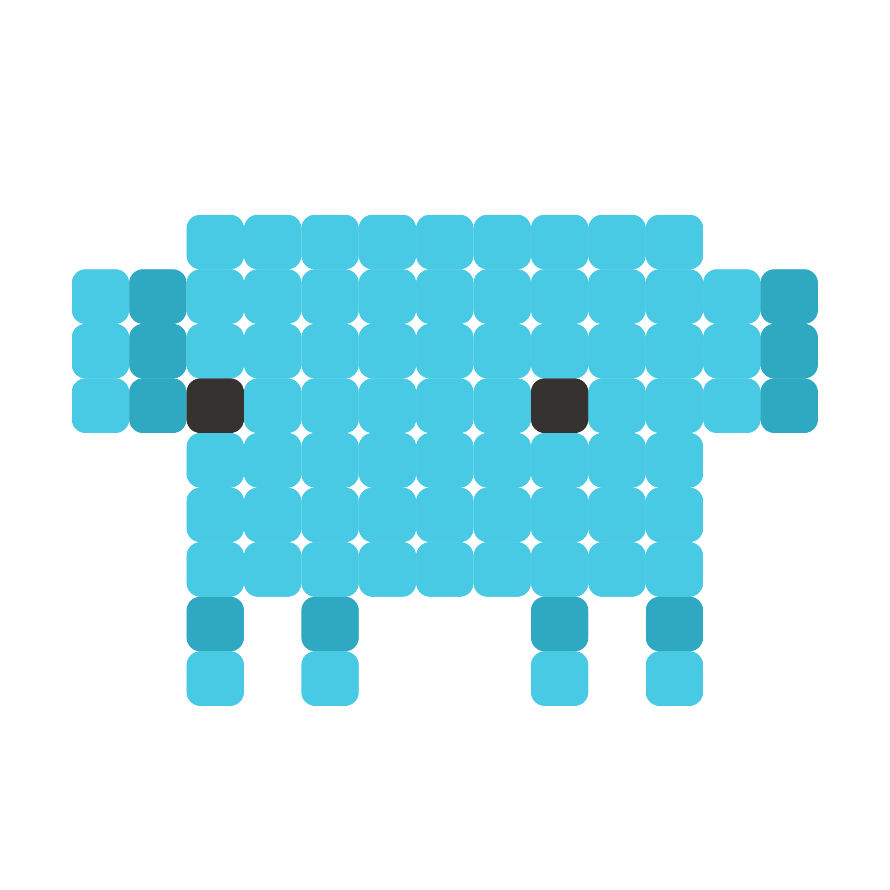

<a id="readme-top"></a>

<!-- PROJECT SHIELDS -->

[![MIT License][license-shield]][license-url]
[![LinkedIn][linkedin-shield]][linkedin-url]

<!-- PROJECT LOGO -->
<br />
<div align="center">
  <a href="https://github.com/Nagell/claude-marketplace">
    
  </a>

  <h3 align="center">Claude Marketplace</h3>

  <p align="center">
    Personal Claude Code marketplace with safety guardrails, auto-formatting, and pre-configured development tools
    <br />
    <a href="./plugins/base-setup/README.md"><strong>Explore the docs »</strong></a>
    <br />
    <br />
    <a href="https://github.com/Nagell/claude-marketplace/issues/new?labels=bug">Report Bug</a>
    ·
    <a href="https://github.com/Nagell/claude-marketplace/issues/new?labels=enhancement">Request Feature</a>
  </p>
</div>

<!-- TABLE OF CONTENTS -->
<details>
  <summary>Table of Contents</summary>
  <ol>
    <li>
      <a href="#about-the-project">About The Project</a>
      <ul>
        <li><a href="#built-with">Built With</a></li>
      </ul>
    </li>
    <li>
      <a href="#getting-started">Getting Started</a>
      <ul>
        <li><a href="#prerequisites">Prerequisites</a></li>
        <li><a href="#installation">Installation</a></li>
      </ul>
    </li>
    <li><a href="#plugins">Plugins</a></li>
    <li><a href="#skill-dependencies">Skill Dependencies</a></li>
    <li>
      <a href="#versioning--releases">Versioning &amp; Releases</a>
      <ul>
        <li><a href="#how-it-works">How it works</a></li>
        <li><a href="#commit-message-format">Commit message format</a></li>
        <li><a href="#files-updated-automatically">Files updated automatically</a></li>
      </ul>
    </li>
    <li><a href="#directory-structure">Directory Structure</a></li>
    <li><a href="#license">License</a></li>
    <li><a href="#contact">Contact</a></li>
    <li><a href="#acknowledgments">Acknowledgments</a></li>
  </ol>
</details>

<!-- ABOUT THE PROJECT -->

## About The Project

A personal Claude Code marketplace that bundles the tooling I want on every machine into a single `/plugin install`. No copy-pasting hooks between projects, no re-wiring MCP servers, no forgetting which CLAUDE.md is the good one.

The marketplace ships core plugin, `base-setup`, which carries safety guardrails, auto-formatting, MCP servers, and shared CLAUDE.md conventions. Versioning and releases are fully automated from commit messages, so adding a plugin is the only manual step.

### Built With

[![Claude Code][Claude]][Claude-url] [![Bash][Bash]][Bash-url] [![GitHub Actions][GitHubActions]][GitHubActions-url] [![Conventional Commits][ConventionalCommits]][ConventionalCommits-url]

<p align="right">(<a href="#readme-top">back to top</a>)</p>

<!-- GETTING STARTED -->

## Getting Started

### Prerequisites

- Claude Code
- Git
- Node.js (for npx-based MCP servers)

### Installation

1. Add the marketplace and install the core plugin

   ```sh
   /plugin marketplace add Nagell/claude-marketplace
   /plugin install base-setup@dawidnitka
   ```

2. Install all recommended plugins in one command

   ```sh
   /base-setup:plugin-setup
   ```

3. Restart Claude Code after installation.

<p align="right">(<a href="#readme-top">back to top</a>)</p>

<!-- PLUGINS -->

## Plugins

| Plugin                                            | Description                                                                        |
| ------------------------------------------------- | ---------------------------------------------------------------------------------- |
| [base-setup](plugins/base-setup/)                 | Safety guardrails, auto-formatting, MCP servers, and CLAUDE.md                     |
| [coding-tutor](plugins/coding-tutor/)             | Codebase-driven tutorials, spaced-repetition quizzes, plus a commit-time nudge     |

<p align="right">(<a href="#readme-top">back to top</a>)</p>

<!-- SKILL DEPENDENCIES -->

## Skill Dependencies

This repo adds a small **non-standard convention**: when one skill relies on another, declare it in the frontmatter under a `dependencies` list (skill names). There is no official field for this yet, and `dependencies` does not collide with any current key, so it's ignored by Claude Code.  
It helps though to understand the relationships between skills during the skill development.

```yaml
---
name: writing-style-guide
description: ...
dependencies:
  - humanizer
---
```

<p align="right">(<a href="#readme-top">back to top</a>)</p>

<!-- VERSIONING & RELEASES -->

## Versioning & Releases

This repository uses [Release Please](https://github.com/googleapis/release-please) for automated versioning based on [Conventional Commits](https://www.conventionalcommits.org/).

### How it works

1. When you merge a PR to `main`, Release Please analyzes commit messages
2. It creates a Release PR with version bumps and changelog updates
3. Merging the Release PR publishes the new version

### Commit message format

| Prefix                         | Version Bump          | Example                       |
| ------------------------------ | --------------------- | ----------------------------- |
| `feat:`                        | Minor (0.1.0 → 0.2.0) | `feat: add new safety hook`   |
| `fix:`                         | Patch (0.1.0 → 0.1.1) | `fix: correct regex in guard` |
| `feat!:` or `BREAKING CHANGE:` | Major (0.1.0 → 1.0.0) | `feat!: redesign hook API`    |

### Files updated automatically

- `plugins/<name>/.claude-plugin/plugin.json` - plugin version
- `.claude-plugin/marketplace.json` - marketplace plugin entry version
- `plugins/<name>/CHANGELOG.md` - changelog

<p align="right">(<a href="#readme-top">back to top</a>)</p>

<!-- DIRECTORY STRUCTURE -->

## Directory Structure

```text
claude-marketplace/
├── .claude-plugin/
│   └── marketplace.json
├── plugins/
│   ├── base-setup/
│   │   ├── .claude-plugin/
│   │   │   └── plugin.json
│   │   ├── hooks/
│   │   ├── agents/
│   │   ├── skills/
│   │   ├── .mcp.json
│   │   ├── CLAUDE.md
│   │   └── README.md
│   └── coding-tutor/
│       ├── .claude-plugin/
│       │   └── plugin.json
│       ├── commands/
│       ├── skills/
│       ├── hooks/
│       ├── LICENSE
│       └── README.md
└── README.md
```

To add a plugin, create only `plugins/<name>/.claude-plugin/plugin.json` — `marketplace.json`, the Release Please config, and version bumps are all handled by CI.

<p align="right">(<a href="#readme-top">back to top</a>)</p>

<!-- LICENSE -->

## License

Distributed under the MIT License. See `LICENSE` for more information.

<p align="right">(<a href="#readme-top">back to top</a>)</p>

<!-- CONTACT -->

## Contact

Dawid Nitka - [LinkedIn][linkedin-url]

Project Link: [https://github.com/Nagell/claude-marketplace](https://github.com/Nagell/claude-marketplace)

<p align="right">(<a href="#readme-top">back to top</a>)</p>

<!-- ACKNOWLEDGMENTS -->

## Acknowledgments

- [Claude Code](https://docs.claude.com/en/docs/claude-code)
- [Release Please](https://github.com/googleapis/release-please)
- [Best-README-Template](https://github.com/othneildrew/Best-README-Template)

<p align="right">(<a href="#readme-top">back to top</a>)</p>

<!-- MARKDOWN LINKS & IMAGES -->

[license-shield]: https://img.shields.io/badge/License-MIT-yellow.svg?style=for-the-badge
[license-url]: ./LICENSE
[linkedin-shield]: https://img.shields.io/badge/-LinkedIn-black.svg?style=for-the-badge&logo=linkedin&colorB=555
[linkedin-url]: https://www.linkedin.com/in/dawidnitka
[Claude]: https://img.shields.io/badge/Claude_Code-D97757?style=for-the-badge&logo=anthropic&logoColor=white
[Claude-url]: https://docs.claude.com/en/docs/claude-code
[Bash]: https://img.shields.io/badge/Bash-4EAA25?style=for-the-badge&logo=gnubash&logoColor=white
[Bash-url]: https://www.gnu.org/software/bash/
[GitHubActions]: https://img.shields.io/badge/GitHub_Actions-2088FF?style=for-the-badge&logo=githubactions&logoColor=white
[GitHubActions-url]: https://github.com/features/actions
[ConventionalCommits]: https://img.shields.io/badge/Conventional_Commits-FE5196?style=for-the-badge&logo=conventionalcommits&logoColor=white
[ConventionalCommits-url]: https://www.conventionalcommits.org/
